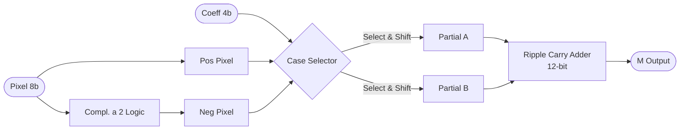

# 3. Circuito moltiplicatore
Strategia con codifica _Booth_ a 4-bit

---
level: 2
---

# Strategia di Implementazione
A differenza di un moltiplicatore di Booth standard che raggruppa i bit, la nostra implementazione sfrutta la dimensione ridotta dei coefficienti del kernel ($3 \times 3$, 4-bit signed)

### Hard-Coded Coefficients
Poiché un numero a 4 bit ha solo $2^4 = 16$ combinazioni possibili (da -8 a +7), abbiamo codificato staticamente il comportamento per ogni caso.

- **Input:** Pixel ($P$) a 8-bit (Unsigned), Coefficiente ($F$) a 4-bit (Signed).
- **Output:** Prodotto ($M$) a 12-bit (Signed).
- **Ottimizzazione:** Sostituzione delle moltiplicazioni costose con operazioni di **Shift** e **Somma/Sottrazione**.

---
level: 2
---

# Codice VHDL
Il modulo calcola in parallelo i 9 prodotti necessari per la convoluzione

<div class="grid grid-cols-5 gap-7">
<div  class="col-span-2">

- **Porte P:** 9 Pixel della finestra corrente (8-bit)
- **Porte F:** 9 Coefficienti del filtro (4-bit)
- **Porte M:** 9 Risultati parziali (12-bit)

La dimensione di uscita è garantita per evitare overflow:

$$Dim_{out} = Dim_{img} + Dim_{coeff} =$$
$$= 8 + 4 = 12 \text{ bit}$$

</div>
<div  class="col-span-3">

```vhdl {all|2-6|8-12|14-15}
entity booth_multiplier is
    generic(
        componente_immagine : POSITIVE := 8;
        coefficiente_filtro : POSITIVE := 4;
        somma : POSITIVE := 12
    );
    port (
        -- Input Pixel (3x3 Matrix)
        P_1_1, ..., P_3_3 : in std_logic_vector(7 downto 0);

        -- Input Coefficients (Fixed/Configurable)
        F_1_1, ..., F_3_3 : in std_logic_vector(3 downto 0);

        -- Output Products
        M_1_1, ..., M_3_3 : out std_logic_vector(11 downto 0)
    );
end entity booth_multiplier;
```

</div>
</div>

---
level: 2
---

# Decomposizione del Prodotto
Per semplificare l'hardware, ogni moltiplicazione $P \times F$ viene scomposta in due sottoprootti parziali ($PP_A$ e $PP_B$) facili da calcolare tramite shift

$$R = (P \times A) + (P \times B)$$

<div text-xs class="grid grid-cols-2 gap-4">
<div>

| Coeff (Bin) | Val (Dec) | A | B | Operazione Hardware |
| --- | --- | --- | --- | --- |
| `0000` | **0** | 0 | 0 | `0` |
| `0001` | **1** | 1 | 0 | `P` |
| `0010` | **2** | -2 | 4 | `(NOT(P)+1)<<1` + `P<<2` |
| `0011` | **3** | -1 | 4 | `(NOT(P)+1)` + `P<<2` |
| `0100` | **4** | 0 | 4 | `P<<2` |
| `0101` | **5** | 1 | 4 | `P` + `P<<2` |
| `0110` | **6** | -2 | 8 | `(NOT(P)+1)<<1` + `P<<3` |
| `0111` | **7** | -1 | 8 | `(NOT(P)+1)` + `P<<3` |

</div>
<div>

| Coeff (Bin) | Val (Dec) | A | B | Operazione Hardware |
| --- | --- | --- | --- | --- |
| `1000` | **-8** | 0 | -8 | `(NOT(P)+1)<<3` |
| `1001` | **-7** | 1 | -8 | `P` + `(NOT(P)+1)<<3` |
| `1010` | **-6** | -2 | -4 | `(NOT(P)+1)<<1` + `(NOT(P)+1)<<2` |
| `1011` | **-5** | -1 | -4 | `(NOT(P)+1)` + `(NOT(P)+1)<<2` |
| `1100` | **-4** | 0 | -4 | `(NOT(P)+1)<<2` |
| `1101` | **-3** | 1 | -4 | `P` + `(NOT(P)+1)<<2` |
| `1110` | **-2** | -2 | 0 | `(NOT(P)+1)<<1` |
| `1111` | **-1** | -1 | 0 | `(NOT(P)+1)` |

</div>
</div>

<style scoped>
  th, td {
    padding-top: 0.1rem !important;    /* Riduce lo spazio verticale */
    padding-bottom: 0.1rem !important;
    line-height: 2 !important;       /* Riduce l'interlinea */
  }
</style>

---
level: 2
---

# Architettura interna del Moltiplicatore
Schema logico per un singolo pixel (replicato 9 volte)



* **Selettore:** Un `CASE` statement
* **RCA Finale:** Somma i due termini parziali estesi a 12 bit per ottenere il risultato finale

---
level: 2
---

# Testing e Validazione
Abbiamo verificato il moltiplicatore coprendo i casi limite (*Corner Cases*) e spazzolando tutto il range dei coefficienti

<div class="grid grid-cols-2 gap-4">
<div>

### Casi di Test

1. **Max Positivo**: Pixel 255  Coeff 7
   * Atteso: $1785$
2. **Max Negativo**: Pixel 255  Coeff -8
   * Atteso: $-2040$
3. **Coefficient Sweep**:
   * Input fisso a 255.
   * Loop coefficienti da -8 a +7.

</div>
<div>

```vhdl {all|5-6|7-10}
-- Test Max Positive
p <- std_logic_vector(to_unsigned(255, 8));
f <- std_logic_vector(to_signed(7, 4));

-- Test Sweep Range
p <- std_logic_vector(to_unsigned(255, 8));
for i in -8 to 7 loop
   f <- std_logic_vector(to_signed(i, 4));
   wait for 50 ns;
end loop;
```

</div>
</div>
