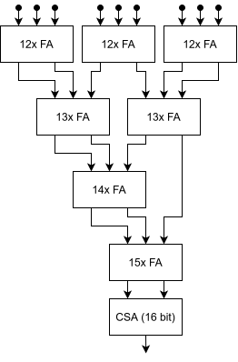
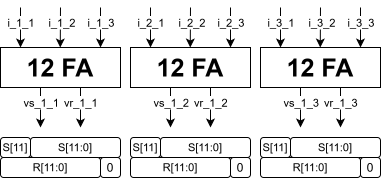
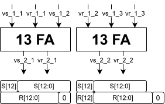
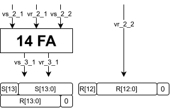
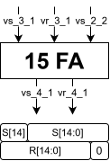
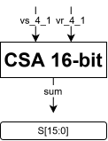
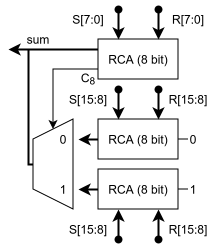

# 3. Carry Save Adder tree
Somma parallela ad alte prestazioni

---
level: 2
---

# Strategia di Somma: Perché Carry Save?
Dobbiamo sommare **9 operandi da 12-bit** (i prodotti parziali) in un singolo ciclo di clock

<div class="grid grid-cols-5 gap-8">
<div class="col-span-3">

### Il Problema del Ripple Carry
Collegare 8 sommatori classici in cascata creerebbe una catena di riporto lunghissima (Critical Path elevato).

$$T_{delay} \approx 9 \times T_{adder}$$

### La Soluzione CSA
L'approccio **Carry Save** spezza la catena del riporto.

- Si sommano gli operandi a gruppi di 3
- Invece di un risultato unico, si generano due vettori:
  - **Sum** e **Carry**
- Il riporto non si propaga orizzontalmente, ma viene salvato per il livello successivo

</div>
<div class="col-span-2">



</div>
</div>

---
level: 2
---

# Codice VHDL
L'entity riceve i 9 prodotti parziali dai moltiplicatori

```vhdl
entity carry_save_adder_tree is
    generic (N : POSITIVE := 12);
    port (
        -- 9 Input da 12-bit (Signed)
        i_1_1, i_1_2, i_1_3 : in std_logic_vector(N-1 downto 0);
        i_2_1, i_2_2, i_2_3 : in std_logic_vector(N-1 downto 0);
        i_3_1, i_3_2, i_3_3 : in std_logic_vector(N-1 downto 0);

        -- Output finale esteso a 16-bit per evitare overflow
        sum : out std_logic_vector(N+3 downto 0)
    );
end carry_save_adder_tree;

```

**Bit Growth:**
Da $12$ bit in ingresso passiamo a $16$ bit in uscita per accomodare la somma massima teorica:

$$ MaxVal \approx 9 \times 2^{12} \rightarrow \text{Requires } 16 \text{ bits} $$

---
level: 2
---

# Gestione dei livelli e allineamento bit
La sfida principale è stata la gestione manuale delle estensioni di segno e degli shift tra i vari livelli dell'albero

### Livelli FA
I 9 input vengono raggruppati in 3 blocchi da 3. Ogni blocco genera *Sum* e *Carry*.

**Regole di Cablaggio:**

1. **Vettore Carry:** Shift a sinistra di 1 (peso aritmetico x2) + riempimento LSB con '0'.
2. **Vettore Sum:** Estensione del segno (MSB) per pareggiare la lunghezza.

Questo processo si ripete, allargando i vettori (12 $\rightarrow$ 13 $\rightarrow$ 14 $\rightarrow$ 15 bit) fino ad avere solo due vettori finali da 16 bit.

---
level: 3
---

# Livello 1

<div class="transform scale-200 origin-top-left">



</div>

---
level: 3
---

# Livello 2

<div class="transform scale-200 origin-top-left">



</div>

---
level: 3
---

# Livello 3

<div class="transform scale-200 origin-top-left">



</div>

---
level: 3
---

# Livello 4

<div class="transform scale-200 origin-top-left">



</div>

---
level: 3
---

# Livello finale (Carry Select Adder)

<div class="transform scale-200 origin-top-left">



</div>

---
level: 2
---

# Stadio Finale: Carry Select Adder
Arrivati a due soli vettori (_Somma Parziale_ e _Riporti Parziali_), serve un vero addizionatore finale

<div class="grid grid-cols-2 gap-8">
<div>

### Scelta Architetturale
Abbiamo optato per un **Carry Select Adder (CSLA)** semplificato.

* **Compromesso:** Più veloce di un Ripple Carry, meno risorse di un Kogge-Stone
* **Semplificazione:** Non gestiamo il  finale e il relativo MUX, poiché il range a 16-bit copre garantitamente il caso peggiore (Overflow impossibile per design)

</div>
<div>



</div>
</div>

---
level: 2
---

# Verifica: Worst Case Analysis
Il modulo è stato validato simulando i casi limite matematici

<div class="grid grid-cols-2 gap-4">
<div>

### Max Positivo (+16065)

* **Pixel**: 9x (+255)
* **Coeff**: 9x (+7)
* **Op**: $9 \times (255 \times 7) = 9 \times 1785 = 16065$
* **Binario**: `0011 1110 1100 0001`

</div>
<div>

### Max Negativo (-18360)

* **Pixel**: 9x (+255)
* **Coeff**: 9x (-8)
* **Op**: $9 \times (255 \times -8) = 9 \times -2040 = -18360$
* **Binario**: `1011 1000 0100 1000`

</div>
</div>

### Risultato Testbench
La simulazione conferma che l'albero di somma propaga correttamente i bit di segno e gestisce l'aritmetica in complemento a due senza errori.
