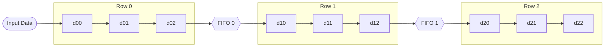

# 5. Buffer & Pipeline
Registri di finestra e FIFO per pipeline

---
level: 2
---

# Architettura Sliding Window
Il modulo `buffer_line` trasforma il flusso seriale di pixel in una matrice 3x3 accessibile in parallelo in un singolo ciclo di clock



I dati viaggiano dalla porta AXI-Stream di ingresso verso l'ultima posizione, caricando l'immagine in ordine inverso nei registri di finestra (`d22` pixel precedente a `d00`).

---
level: 2
---

# Implementazione: Shift Register Arrays
Le FIFO sono implementate usando una struttura parametrica

Viene definito un `array` di `std_logic_vector` con un numero di elementi pari a $N_{col,img} - N_{col,ker}$.

```vhdl {1-4|6-19|all}
-- Calcolo dimensione buffer:
-- Image Width (32) - Window Size (3) = 29 elementi di buffer
type reg_array is array (ncol-4 downto 0) of std_logic_vector(7 downto 0);
signal buffer1, buffer2 : reg_array;

-- Processo di scorrimento (Line Buffer 1)
process(clk)
begin
    if rising_edge(clk) then
        if valid = '1' then
            -- Ingresso dal registro finale della riga precedente
            buffer1(0) <- d02s;
            -- Shift dell'intera riga
            for j in 1 to ncol-4 loop
                buffer1(j) <- buffer1(j-1);
            end loop;
        end if;
    end if;
end process;
```

---
level: 2
---

# Gestione del Flush
Quando l'ultimo pixel dell'immagine entra nella pipeline, la finestra non è ancora vuota (l'ultimo pixel non è ancora stato filtrato)

### Logica di "Padding" a Zeri
Quando il segnale `flush` è attivo, l'ingresso viene forzato a `'0'`, permettendo ai pixel reali di avanzare nei registri successivi senza introdurre artefatti.

```vhdl {4-8}
if valid = '1' then
    -- Se siamo in fase di FLUSH, carichiamo zeri (Padding)
    -- per svuotare la pipeline dai pixel validi residui
    if flush = '1' then
        d00s <- (others => '0');
    else
        d00s <- data; -- Pixel reale
    end if;

    d01s <- d00s; -- Shift...
end if;
```

Questo garantisce che l'ultimo pixel dell'immagine venga processato correttamente al **centro** della finestra (`d11`) prima di chiudere il frame.
