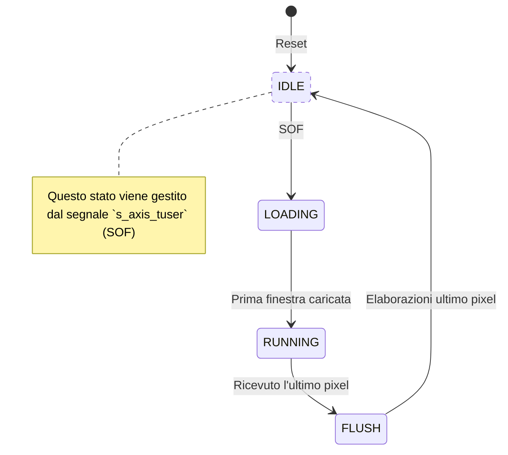

# 6. Finite State Machine e Interfacce AXI-Stream
Orchestrazione della _pipeline_ e **interfacce AXI-Stream**

---
level: 2
---

# Diagramma degli Stati della FSM
La FSM è strutturata nel seguente modo

<div class="grid grid-cols-2 gap-8 mt-4">
<div>

La macchina a stati principale controlla il _riempimento_ e lo _svuotamento_ della finestra `3x3`.

Ogni stato gestisce 3 segnali relativi alla pipeline:
- `pipeline_en`: gestisce l'avanzamento dei dati nella pipeline
- `window_valid`: gestisce il registro di uscita (sampling del pixel filtrato)
- `flush_pipeline`: gestisce se leggere un nuovo pixel o _zero_ in ingresso alla pipeline

</div>

<div class="flex justify-center mt-8">



</div>
</div>

<br>

> **Nota**: Lo stato di `IDLE` è assente in quanto si fa uso del segnale `s_axis_tuser` (**Start Of Frame**) per avviare la _pipeline_.

---
level: 2
---

# Gestione dell'Interfaccia AXI Stream
Il design agisce come un nodo di elaborazione stream (slave in ingresso, master in uscita), gestendo _handshake_, i segnali `TLAST` e `TUSER` e gestendo eventuale _back-pressure_ a valle del circuito.

<div class="grid grid-cols-2 gap-8 mt-4">
<div>

### AXI Slave (Ingresso)

- **Handshake**: `s_axis_tready` viene asserito quando la pipeline può avanzare (non siamo in `FLUSH` e l'uscita non è **bloccata**)
- **SOF (`tuser`)**: Campionato per avviare la pipeline
- **EOL (`tlast`)**: Campionato per contare le righe in ingresso e innescare la fase di `FLUSH` alla fine dell'immagine

</div>

<div>

### AXI Master (Uscita)

- **Handshake**: `m_axis_tvalid` è alto *solo* quando `window_valid = '1'` (finestra 3x3 piena e dato in uscita valido)
- **SOF (`tuser`)**: Rigenerato artificialmente e tenuto alto per un solo ciclo in corrispondenza del primo pixel valido in uscita
- **EOL (`tlast`)**: Generato internamente da un contatore di _colonna_ per segnalare la fine della riga elaborata

</div>
</div>

---
level: 2
---

# Start of Frame (SOF) & Rimozione dell'IDLE
Sfruttamento del segnale `tuser` per eliminare lo stato di `IDLE`

Invece di avere uno stato inattivo la FSM si ferma fino a quando non arriva un **SOF**.

```vhdl {10-15|all}
-- Processo Sincrono della FSM
if rising_edge(s_axis_clk) then
    if s_axis_rstn = '0' then
        current_state <= LOADING;
        -- Reset registri...

    elsif pipeline_en_s = '1' then

        -- LOGICA DI SINCRONIZZAZIONE SOF
        -- Se arriva un TUSER valido, è SEMPRE l'inizio di un nuovo frame.
        if s_axis_tvalid = '1' and s_axis_tuser = '1' then
            current_state   <= LOADING;
            latency_counter <= 1; -- Abbiamo già il primo pixel
            flush_pipeline_s<= '0'; -- Interrompe flush precedenti
            m_axis_tuser_s  <= '0';
            -- Reset contatori...
        else
            -- Evoluzione normale degli stati (LOADING, RUNNING, FLUSH)

```

---
level: 2
---

# Controllo Pipeline e Backpressure
La logica combinatoria che governa l'abilitazione dei registri (`pipeline_en`) è il cuore del dataflow

```vhdl {2-4|6-7|all}
-- 1. Controllo Pipeline (Avanzamento Globale)
pipeline_en_s <= '1' when ((s_axis_tvalid = '1' or current_state = FLUSH)
                           and (m_axis_tready = '1' or window_valid_s = '0'))
                     else '0';

-- 2. Handshake Ingresso (TREADY)
s_axis_tready <= '1' when (current_state /= FLUSH and m_axis_tready = '1') else '0';

```

### Analisi della Backpressure
Il segnale `m_axis_tready` in ingresso indica se il ricevitore a valle può accettare dati.
Se va basso (`'0'`) mentre la finestra è valida, **`pipeline_en_s` va a `'0'**`.
L'intero datapath si _"congela"_, preservando i risultati parziali senza perdere alcun pixel, per poi ripartire istantaneamente appena il ricevitore torna pronto.
