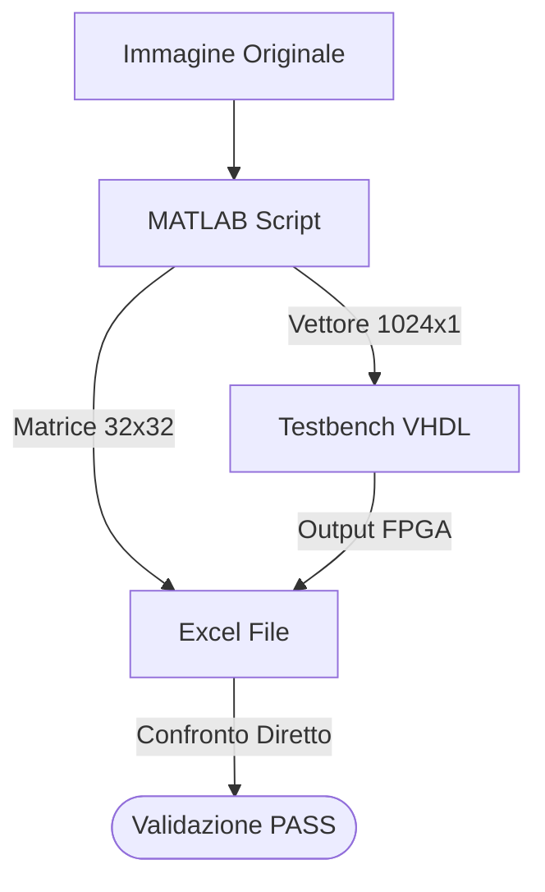
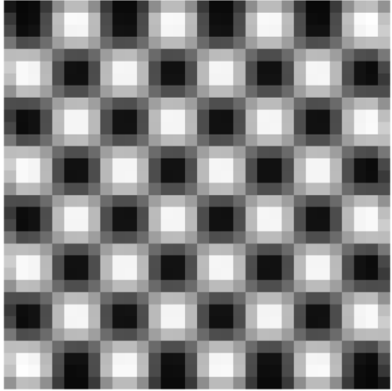
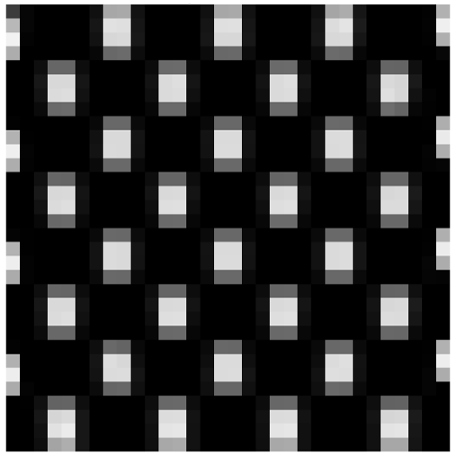

# 7. Risultati e Conclusioni
Validazione del design e analisi _post-implementation_

---
level: 2
---

# Metodologia di Validazione
Per verificare il corretto funzionamento del circuito, abbiamo implementato un flusso di test automatizzato basato su script MATLAB ed Excel

1. **Generazione Stimoli (MATLAB)**: Creazione di un'immagine test (**Scacchiera** 32x32) esportata in due _formati_ testuali (**vettore** 1024x1 per VHDL, **matrice** 32x32 per **Excel**)
2. **Simulazione VHDL**: Esecuzione del _testbench_ fornendo il file **vettore** e genera l'immagine filtrata (sempre formato **vettore** 1024x1)
3. **Confronto (Excel)**: Foglio di calcolo che _emula_ il filtraggio esatto e confronta i pixel **attesi** con l'output **effettivo** della simulazione

---
level: 2
---

# Caso d'uso 1: Filtro Gaussiano
Test con filtro sfocatura (blurring) per verificare il comportamento del circuito

### Parametri del Filtro

* **Kernel**: Matrice simmetrica $3 \times 3$
* **Normalizzazione**: Divisione finale per $16$

| Col 1 | Col 2 | Col 3 |
| ----- | ----- | ----- |
| **1** | **2** | **1** |
| **2** | **4** | **2** |
| **1** | **2** | **1** |

### Risultato Visivo
Confronto tra l'input e l'output elaborato

---
level: 2
---

# Caso d'uso 2: Filtro di Sobel (Verticale)
Test con filtro Sobel (vertical edge detection) per analizzare il comportamento con coefficienti negativi e nulli

### Parametri del Filtro

* **Kernel:** Rilevamento dei gradienti verticali
* **Normalizzazione:** Divisione finale per $4$

| Col 1  | Col 2 | Col 3 |
| ------ | ----- | ----- |
| **-1** | **0** | **1** |
| **-2** | **0** | **2** |
| **-1** | **0** | **1** |

### Risultato Visivo
I bordi verticali della scacchiera vengono evidenziati correttamente

---
level: 2
---

# Analisi Post-Implementation e Confronto
L'analisi dei report generati da Vivado rivela differenze architetturali significative tra i due filtri, nonostante il VHDL di base sia identico

| Parametri                      | Filtro Gaussiano | Filtro Sobel (Verticale) | Differenza |
| ------------------------------ | ---------------- | ------------------------ | ---------- |
| **WNS** (Worst Negative Slack) | $2.460$ ns       | $2.812$ ns               | $0.352$ ns |
| **LUTs**                       | 158              | 153                      | -5         |
| **Registers**                  | 155              | 159                      | 4          |
| **Dynamic** power              | $12$ mW          | $13$ mW                  | $1$ mW     |
| **Static** power               | $105$ mW         | $104$ mW                 | $-1$ mW    |
| **Total** _On-Chip_ power      | $117$ mW         | $117$ mW                 | $0$ mW     |

### Perché il filtro di Sobel è più efficiente?
L'ottimizzatore (_Synthesizer_) riconosce i coefficienti statici del filtro:

1. **Colonne a Zero**: Nel **Sobel**, la colonna centrale è composta da `0`, il sintetizzatore elimina fisicamente i moltiplicatori e le linee dati associate
2. **Critical Path Ridotto**: Operandi nulli o più piccoli generano riporti più corti nell'**albero CSA**, velocizzando il percorso critico
3. **Risparmio Area/Potenza**: La rimozione logica (_pruning_) riduce l'utilizzo di **LUT** e il conseguente consumo di _potenza statica_

 

> Note: Clock period $10$ ns ($100$ MHz)

